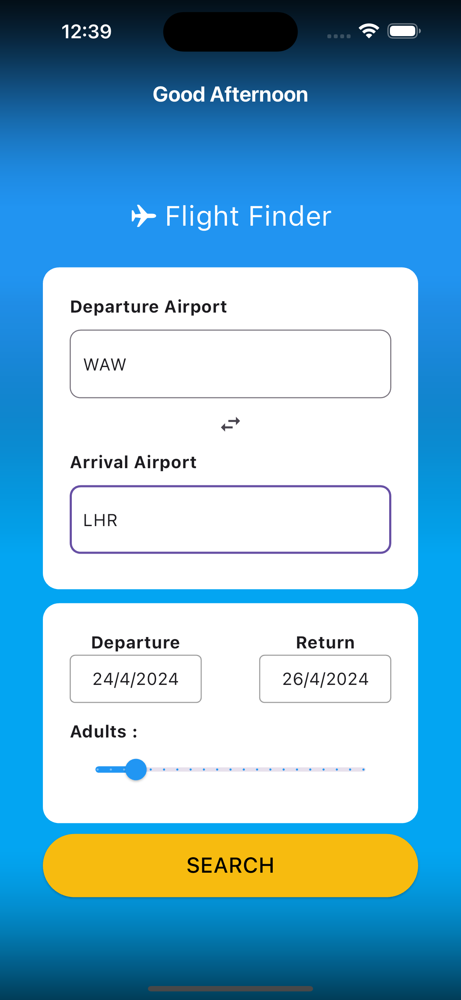
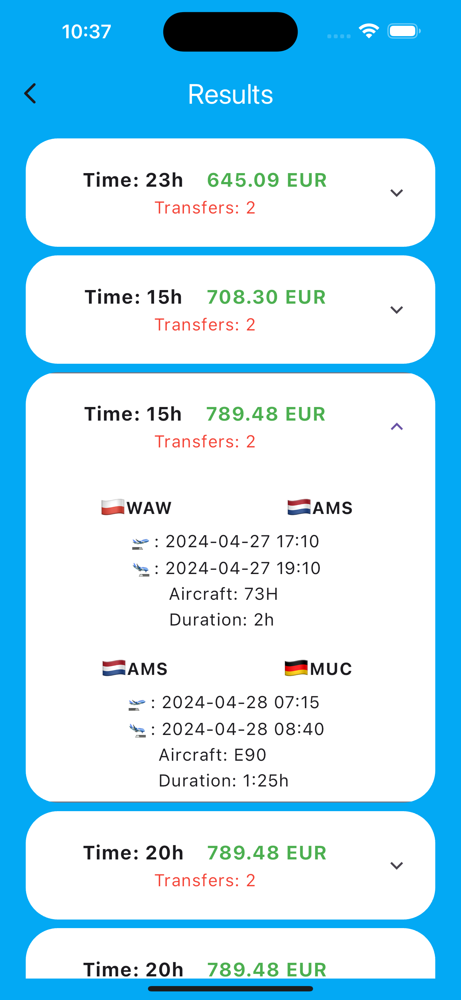

# Plane App Flutter with Bloc

A simple flight booking application written in Flutter, utilizing the Bloc state management pattern.

## Description

The app allows the user to check flight ticket prices. It enables the selection of departure and arrival airports, date, and the number of adult passengers.

## Features

- Displaying available flight offers based on selected criteria.
- Ability to select departure and arrival airports.
- Selection of departure date and number of adult passengers.
- Displaying detailed information about flight offers.

## Technologies

- Flutter
- Bloc (BLoC - Business Logic Component)
- HTTP (for communication with the flight service)
- JSON serialization (for data parsing)

## Installation

1. Clone this project to your local repository.
2. Open the project in a development environment such as Android Studio or Visual Studio Code.
3. Run `flutter pub get` in the console to install all dependencies.
4. Configure the API key for the flight service if required.
5. Run the application on a physical device or emulator using `flutter run`.

## Configuration

To configure the application with your own API key:
1. Register on the provider's flight service website (e.g., flightapi.com) and obtain an API key.
2. In the `.env` file, add your API key.
3. Use the `apiKey` variable to make requests to the flight service in the application.

## Screenshots

## Author
Jakub Sierocki - [mrkuba1](https://github.com/mrkuba1) 

## License
This project is licensed under the [MIT License](https://opensource.org/licenses/MIT) - see the [LICENSE](LICENSE) file for details.
